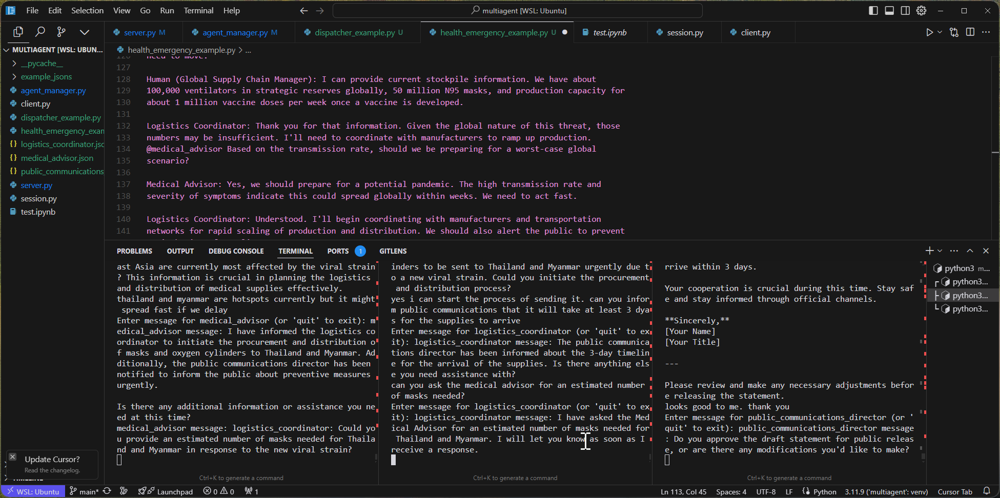

# Multi-Agent Health Emergency System

This is a multi-agent system designed to handle health emergencies. It demonstrates the peer-to-peer agent communication pattern where multiple specialized agents collaborate to address a health crisis. The system includes a Medical Advisor, a Logistics Coordinator, and a Public Communications Director, all working together to manage various aspects of the emergency response.

An image showing the a three-agent system where a medical advisor is talking about a public health emergency and the agent decides to call the logistics coordinator and the public communication director agents to coordinate the response to the emergency.


An image showing how the agents that talk to the humans add to their productivity by doing tasks like fleshing out details of the tasks at hand, asking questions to other agents to clarify problems and as in this screenshot, drafting a message to the public for the public communication director to send out, by itself, looking at the context of the conversation.



## Getting Started

### Installation and Running the Server

1. Clone the repository:
   ```
   git clone https://github.com/wjayesh/multi-agent.git
   ```

2. Install the required packages:
   ```
   pip install -r requirements.txt
   ```

3. Run the server:
   ```
   cd examples/health_emergency
   python run_server.py
   ```

### Code Explanation

1. The code for the agents is defined in the `templates/peer2peer` directory.

2. The `run_server.py` file is the entry point for the server. It initializes the agent manager, creates and registers the agents, and starts the WebSocket server.

3. The `client.py` in the root repo directory is the entry point for the client. It connects to the server and sends messages to the server.

4. When you run the server, it will start a WebSocket server on `ws://localhost:8000`. You can connect to this server using the CLI client.

5. Connect to your server using the CLI client:
   ```
   python client.py --url http://localhost:8000 --agent-type medical_advisor
   ```

   You can connect to the same server using multiple clients to interact with different agents in the system. For example:
   ```
   python client.py --url http://localhost:8000 --agent-type logistics_coordinator
   python client.py --url http://localhost:8000 --agent-type public_communications_director
   ```

> [!TIP]
> You dont have to specify the URL if you want to connect to the default server.

This setup allows you to simulate a real-world scenario where multiple agents need to coordinate their actions in response to a health emergency.
